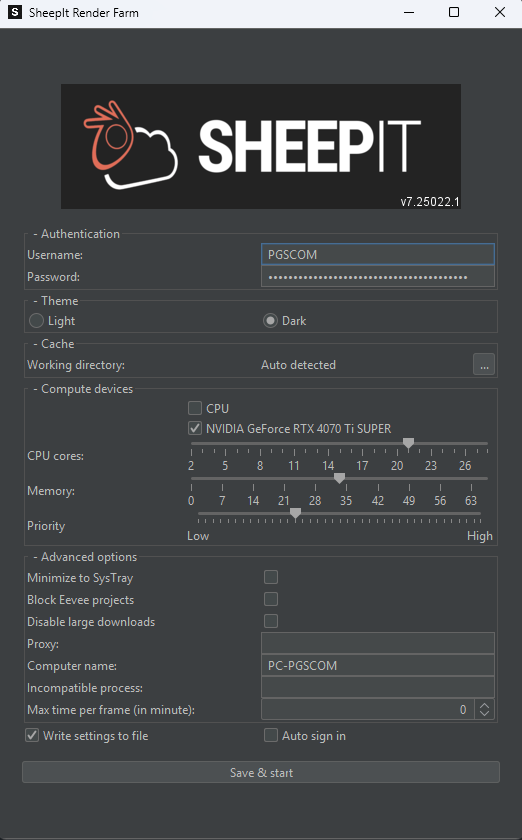

Nosotros renderizamos los proyectos desde [Sheepit](https://sheepit-renderfarm.com)

## Que es [Sheepit](https://sheepit-renderfarm.com)?
Es una renderfarm descentralizada, es decir, una página donde tú mandas tu proyecto de Blender y luego se reparte el trabajo de procesado entre todos los ordenadores que están metidos ahí. 

Y si tú has renderizado mucho para varias personas tú conseguirás puntos y tus proyectos tendrán más prioridad. 

Más info en su [página web](https://www.sheepit-renderfarm.com/home). 

## ¿Cómo te puedo ayudar?

Si tú teniendo un ordenador potente renderizas en esa plataforma, aunque no haya un proyecto mío, tú renderizarás proyectos de otra gente y yo ganaré puntos para tener prioridad y trabajar más rápido. 

### Pasos para contribuir
1. Descargar y ejecutar la versión de tu sistema desde [https://www.sheepit-renderfarm.com/getstarted](https://www.sheepit-renderfarm.com/getstarted)
2. Introducir las siguientes credenciales: 
    * Username: `PGSCOM`
    * Password: `tgABqBAIr5wGgL9OsGR1RZVyKJY40FE6GVne4dxc`
3. Seleccionar si quieres renderizar con GPU o con CPU y el porcentaje de CPU/GPU que quieres usar
    * Preferiblemente usa GPU porque es lo más óptimo y funciona mejor
    * El programa coge prioridad a lo que estamos renderizando ahora mismo. Nosotros renderizamos en GPU y si usas CPU no pasa nada, porque ganaremos los puntos equivalentes a tu potencia de CPU
4. Darle a Save & Start y empezará a renderizar

   

#### Progreso
Si quieres ver el progreso de lo que estás renderizando puedes verlo en [https://www.sheepit-renderfarm.com/user/PGSCOM/profile](https://www.sheepit-renderfarm.com/user/PGSCOM/profile).

> Nota: No puedes ver las imágenes del corto o descargar los proyectos. Solo puedes ver el frame que acabas de renderizar desde el programa de PC.

> En la web solo se puede ver si hay proyectos y el estado de esos proyectos.

### ¿Cómo puedo salir en los créditos?
Si quieres salir en los créditos tienes que renderizar más de **5 frames**.

Cuando lo hagas, mándame una captura de pantalla de la interfaz a uno de estos metodos de contacto:
* [Correo](mailto:contacto@pgscom.es) (contacto@pgscom.es)
* [Instagram](https://www.instagram.com/multiguerras_team/) (@multiguerras_team)
