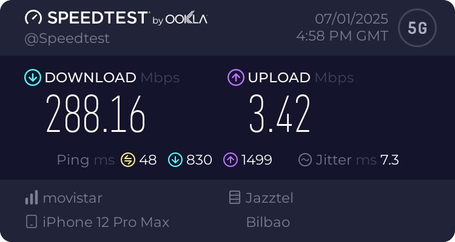
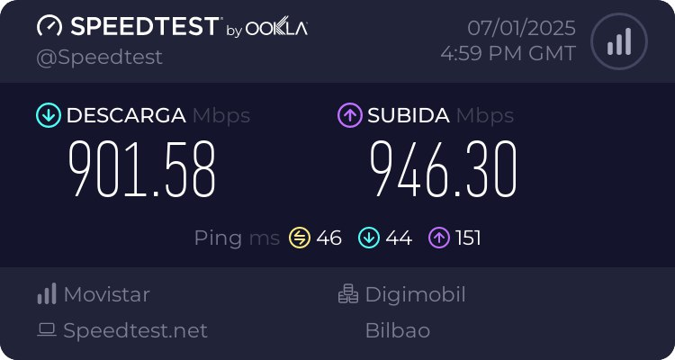
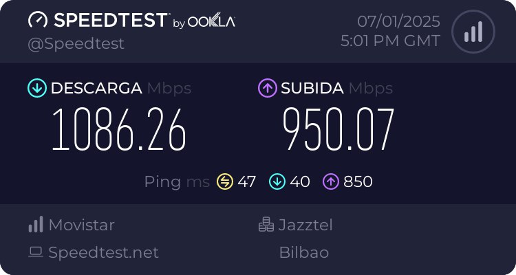
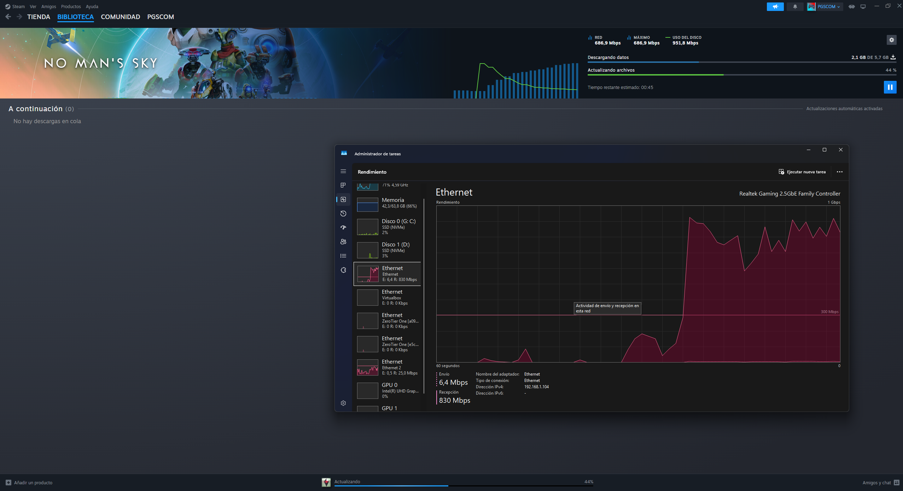
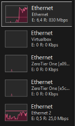

Hey! ¡Cuanto tiempo sin escribir aquí! Habia que dedicar mucho tiempo a la Pau :D

El curso que viene puede que tenga que ir a una residenciad de estudiantes. Y algo que no me gustaba era la idea de tener que descargar cosas a 100Mb/s (Aun así no está mal, pero es un cambio respecto a los 1Gb/s que tengo en casa). Y se me ocurrió una idea: ¿Y si fusiono el ancho de banda de mi teléfono (5G) con el WiFi que ofrece la residencia?

# Investigación
Estuve investigando con IAs como Perplexity y Grok (Sus funciones de búsqueda son geniales) y encontré que había un programa llamado "Speedify" que hacía lo que buscaba, fusionar la velocidad.

## [Speedify](https://speedify.com/)
[Speedify](https://speedify.com/) es al final una especie de VPN. La cual usa las varias conexiones (WiFi, Ethernet, ...) para conectarse a sus servidores. Y luego su servidor junta los datos de todas las conexiones y las envía a la ip que quieras contactar. Vamos, una VPN pero con la función de conectarte con varias conexiones a la vez.

### Contras
- **Precio**: [Speedify](https://speedify.com/) es de pago si quieres ancho de banda ilimitado (15€/mes). Y si no, solo puedes usar 2GB al mes de forma gratuita.
- **Velocidad limitada**: La velocidad de los servidores, incluso los de pago, tienen una velocidad limite de 200-300Mb/s (Para mí no sería un problema con la velocidad que alcanzaría, pero para otros puede ser un problema).
### Pros
- **Fácil de usar**: La interfaz es muy sencilla y fácil de usar. Cualquier persona lo puede usar sin necesidad de conocimientos técnicos.
- **Puedes usar tu propio servidor**: Tienen una opción selfhosting si pagas por la versión de pago. Lo que quita el problema de la velocidad limitada.

## Alternativas open source
Al ver que había un programa por el que había que pagar, normalmente la gente hace altennativas de código abierto. Me puse a investigar y encontré un programa que hacía lo que yo quería.
### [go-dispatch-proxy](https://github.com/extremecoders-re/go-dispatch-proxy)



Un programa escrito en Go que crea un proxy virtual y distribuye el tráfico que entra en él entre las interfaces de red de Windows que elijas (En mi caso WiFi y el iPhone).
### Cliente de proxy
[go-dispatch-proxy](https://github.com/extremecoders-re/go-dispatch-proxy) se utiliza mediante un proxy SOCKS5, por lo que si quiero usarlo con aplicaciones que no soportan proxies, tengo que usar otro programa que redirija el tráfico de la aplicación a través del proxy.
#### Opciones
- **[Proxifier](https://www.proxifier.com/)**: Pago único de 40$. Envuelve todo el tráfico del sistema. Con interfaz gráfica
- **[tun2socks](https://github.com/xjasonlyu/tun2socks)**: Gratuito, pero es complicado de configurar. Envuelve todo el tráfico del sistema.
- **[proxifyre](https://github.com/wiresock/proxifyre)**: Gratuito, solo envuelve el tráfico de aplicaciones seleccionadas. Para mí es más facil de configurar que tun2socks.

Y al final, me quedé con [proxifyre](https://github.com/wiresock/proxifyre) al ver que solo envolvía el tráfico de las aplicaciones que yo quisiera (Dado que este sistema lo quiero usar de forma casual cuando haya que descargar algo grande).



<br><br>

# Configuración
## Instalación de [go-dispatch-proxy](https://github.com/extremecoders-re/go-dispatch-proxy)
Para instalar [go-dispatch-proxy](https://github.com/extremecoders-re/go-dispatch-proxy) es muy sencillo, dado que no tiene ninguna dependencia externa. Solo hay que descargar el ejecutable y listo. 

Luego con ayuda del comando `go-dispatch-proxy.exe -list` se pueden ver las interfaces de red disponibles:

```bash
PS C:\Users\pablo> go-dispatch-proxy.exe -list
--- Listing the available adresses for dispatching
[+] Ethernet, IPv4:192.168.1.104
[+] Virtualbox, IPv4:192.168.56.1
[+] Ethernet 2, IPv4:172.20.10.6
[+] vEthernet (Default Switch), IPv4:172.23.64.1
```
En mi caso, tengo que utilizar Ethernet (Mi cable de red de casa) y Ethernet 2 (Mi iPhone conectado por USB)

Entonces simplemente con poner el comando `go-dispatch-proxy.exe 192.168.1.104 172.20.10.6` se inicia el proxy SOCKS5 en el puerto local `8080` que ya se puede usar en las aplicaciones compatibles.

## Instalación de [proxifyre](https://github.com/wiresock/proxifyre)
Para instalar [proxifyre](https://github.com/wiresock/proxifyre) hay que instalar [las dependencias](https://github.com/wiresock/proxifyre?tab=readme-ov-file#quick-start-guide), descargar el ejecutable y luego meter en su misma carpeta un .json de configuración llamado ´app-config.json´ donde se le dice qué aplicaciones se quieren envolver en el proxy y el proxy. (Todo este proceso está detallado en su [README](https://github.com/wiresock/proxifyre?tab=readme-ov-file#quick-start-guide))

Este sería mi archivo app-config.json para que funcione con Steam (Antes de eso hay que detectar el nombre del .exe de la aplicación con Process Explorer o el Administrador de tareas):
```json
{
 "logLevel": "None",
 "proxies": [
         {
         "appNames": ["steam.exe", "C:\\Program Files\\WindowsApps\\ROBLOXCORPORATION.ROBLOX", "steamservice.exe", "steamwebhelper.exe", "brave.exe"],
         "socks5ProxyEndpoint": "127.0.0.1:8080",
         "username": "",
         "password": "",
         "supportedProtocols": ["TCP"]
         },
         {
         "appNames": ["firefox", "firefox_dev"],
         "socks5ProxyEndpoint": "127.0.0.1:8080",
         "supportedProtocols": ["TCP"]
         }
     ]
}
```


**Ojo!** Lo malo de este proxy es que no admite UDP (El protocolo de red que usan la mayoría de juegos online).


<br>

# Testeo
Para probar que funciona, he hecho un test de velocidad con [Speedtest](https://www.speedtest.net/) y he obtenido estos resultados:

## Resultados de velocidad

| Tipo de conexión | Descarga | Subida | Ping | Enlace al resultado |
|---|---|---|---|---|
| **Móvil (5G)** | 288.16 Mbps | 3.42 Mbps | 48ms | [Ver resultado](https://www.speedtest.net/result/i/6654436286) |
| **Ethernet (Casa)** | 901.58 Mbps | 946.30 Mbps | 46ms | [Ver resultado](https://www.speedtest.net/es/result/17921356222) |
| **Proxy fusionado** | **1086.26 Mbps** | **950.07 Mbps** | **47ms** | [Ver resultado](https://www.speedtest.net/es/result/17921364494) |

### Capturas de pantalla

| Móvil (5G) | Ethernet (Casa) | Proxy fusionado |
|---|---|---|
|  |  |  |

## Prueba práctica: Descarga en Steam

Para comprobar el funcionamiento en una situación real, realicé la descarga de un juego desde Steam:

<div style="display: flex; gap: 20px; align-items: center;">
  <div>
    
    <p><em>Monitoreo de red mostrando ambas conexiones activas</em></p>
  </div>
  <div>
    
    <p><em>Descarga de Steam utilizando el ancho de banda combinado</em></p>
  </div>
</div>

Se puede observar claramente que se están utilizando las dos conexiones de red simultáneamente: Ethernet 2 (iPhone) y Ethernet (conexión de casa).

# Conclusión
La fusión de conexiones funciona correctamente. En ambos casos se utilizan las dos conexiones de red, solo que no se puede aprovechar al máximo debido a:
- **Limitaciones del operador**: La velocidad del 5G puede ser limitada a 10 Mbps, que fue lo que pasó después de hacer tantas pruebas.
- **Limitaciones de la red telefónica**: La red telefónica, si hay mucha gente conectada, se puede saturar y no alcanzar la velocidad máxima.
- **Limitaciones del teléfono**: El iPhone puede que no soporte velocidades muy altas de los datos compartidos por el puerto USB-C.

Donde más se ve el aumento de velocidad es en el test de velocidad con el proxy, donde ambas velocidades se suman llegando hasta 1086.26 Mbps de descarga y 950.07 Mbps de subida.

Esto respecto a la velocidad de mi red domestica es casi insignificante, porque al final en programas como Steam no pueden aprovechar todo ese ancho de banda. Pero cuando tenga en la residencia una conexión de 100Mb/s, esto me permitirá descargar a aproximadamente el doble o el triple de velocidad.